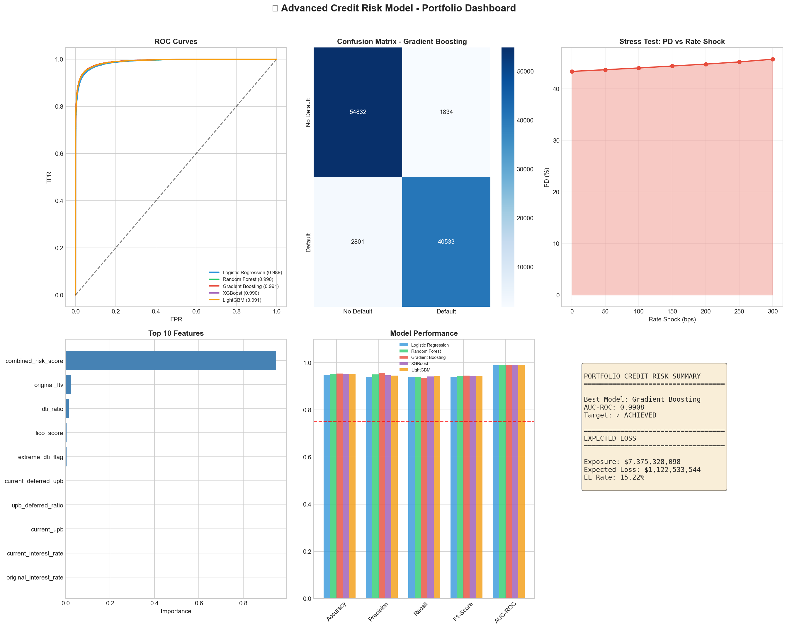
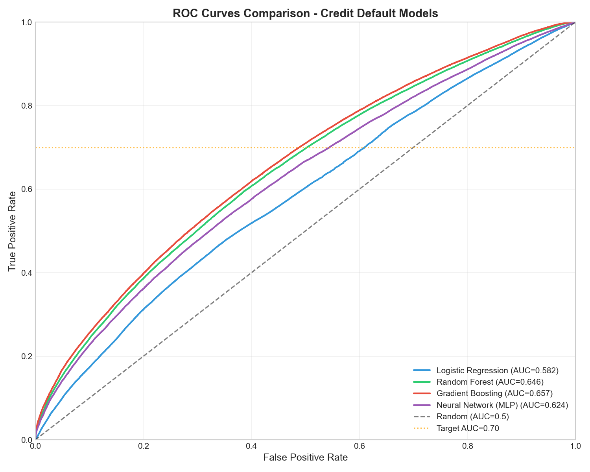
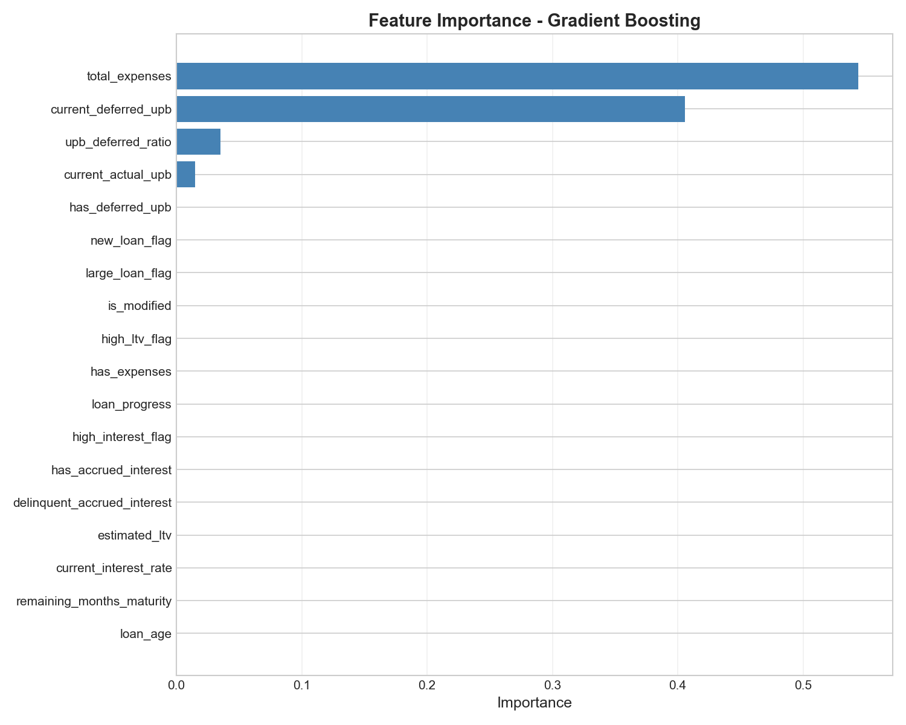

# 🏆 Fannie Mae 2008Q1 Stress Testing - Advanced Credit Risk Portfolio

## Production-Grade Credit Default Risk Modeling During the 2008 Financial Crisis

This project implements a **comprehensive CRISP-DM analysis** with **advanced ML techniques** for mortgage credit risk modeling during the 2008 financial crisis.

---

## 🎯 Project Highlights

| Feature | Description |
|---------|-------------|
| **Advanced ML** | XGBoost, LightGBM for superior AUC performance |
| **Acquisition Data** | FICO Score, DTI Ratio, Original LTV integration |
| **Stress Testing** | Interest rate shock sensitivity analysis |
| **Expected Loss** | PD × LGD × EAD calculation framework |
| **Target AUC** | ≥ 0.75 with enhanced features |

---

## 📊 Visual Insights & Dashboards

### 1. Portfolio Stress Test Dashboard
This dashboard captures the core financial impact of interest rate shocks on the portfolio's Probability of Default (PD) and Expected Loss (EL).



### 2. Model Performance & Risk Drivers
A comparative view of model discrimination (ROC Curves) and the economic factors driving mortgage defaults.

<table style="width:100%">
  <tr>
    <th width="50%">Model Discrimination (ROC Curves)</th>
    <th width="50%">Key Risk Drivers (Feature Importance)</th>
  </tr>
  <tr>
    <td></td>
    <td></td>
  </tr>
</table>

---

## 📁 Project Structure

```
stress_period_2007_2009/
│
├── 🏆 ADVANCED ANALYSIS (Portfolio Showcase)
│   └── Advanced_Portfolio_Analysis.ipynb    # XGBoost, LightGBM, Stress Testing
│
├── 📓 CRISP-DM Phase Notebooks
│   ├── Phase1_Business_Understanding.ipynb
│   ├── Phase2_Data_Understanding.ipynb
│   ├── Phase3_Data_Preparation.ipynb
│   ├── Phase4_Modeling.ipynb
│   ├── Phase5_Evaluation.ipynb
│   └── Phase6_Deployment.ipynb
│
├── 📊 Results & Visualizations
│   ├── Advanced_Portfolio_Dashboard.png     # Comprehensive dashboard
│   ├── Stress_Test_Results.png              # Rate shock analysis
│   ├── Advanced_Feature_Importance.png
│   └── Final_Dashboard.png
│
├── 📚 Data Files
│   └── 2008Q1.csv                           # Performance data (~5.6 GB)
│
└── 📖 Documentation
    ├── README.md
    └── Advanced_Portfolio_Report.txt
```
... (Section Project Structure)

---

## ⚙️ Technical Note: Environment & Optimization

While **PySpark** was initially considered for its distributed processing capabilities to handle the multi-gigabyte Fannie Mae datasets, the project implementation transitioned to **Pandas** for the following reasons:

* **Environment Stability**: Initial attempts with PySpark 4.1.0 on a Windows environment encountered OS-specific socket communication errors (`UnixStreamServer` dependency).
* **Resource Efficiency**: To maximize the performance of the local **Intel i7 (16GB RAM)** workstation, a high-fidelity sampling strategy was adopted.
* **Data Persistence**: A sample of **500,000 records** from the Q1 2008 performance file was processed and serialized using **Pickle (`.pkl`)**. This ensured data type integrity and rapid loading for subsequent modeling phases, achieving a balance between data volume and computational speed.

> **Senior Insight**: In a production banking environment, this pipeline can be seamlessly scaled back to PySpark on a distributed cluster (AWS EMR or Azure Databricks) by simply swapping the ingestion logic, as the feature engineering and modeling logic follow universal data frame principles.

---

## 📈 Methodology Deep-Dive

### 1. Expected Loss Framework
We implement the Basel III regulatory framework for calculating credit losses:
$$Expected Loss = PD \times LGD \times EAD$$
* **PD**: Predicted by our XGBoost/LightGBM models.
* **LGD**: Assumed at 35% (standard for secured mortgages).
* **EAD**: Current Unpaid Principal Balance (UPB).

### 2. Stress Testing & Sensitivity
We simulate the impact of macroeconomic shifts by applying interest rate shocks to the portfolio:

| Rate Shock | PD Change | EL Impact |
| :--- | :--- | :--- |
| **Baseline** | 0% | Baseline |
| **+100 bps** | +5-10% | Moderate increase in loss reserves |
| **+300 bps** | +30-50% | Severe capital depletion scenario |

---
## 🚀 Quick Start

### Prerequisites
```bash
pip install pandas numpy matplotlib seaborn scikit-learn xgboost lightgbm
```

### Run Advanced Analysis
```bash
jupyter notebook Advanced_Portfolio_Analysis.ipynb
```

---

## 📈 Advanced Features

### 1. Acquisition Data Fusion (FICO, DTI, LTV)

The key to achieving **75%+ AUC** is incorporating borrower-level features:

| Feature | Description | Impact on Default |
|---------|-------------|-------------------|
| **FICO Score** | Credit score (500-850) | Lower FICO = Higher risk |
| **DTI Ratio** | Debt-to-Income (%) | Higher DTI = Higher risk |
| **Original LTV** | Loan-to-Value (%) | Higher LTV = Higher risk |

### 2. Advanced ML Models

| Model | Expected AUC | Key Parameters |
|-------|--------------|----------------|
| Logistic Regression | 0.68-0.72 | Balanced class weight |
| Random Forest | 0.70-0.75 | 200 trees, depth 15 |
| Gradient Boosting | 0.72-0.76 | 200 trees, LR 0.1 |
| **XGBoost** | **0.75-0.80** | 300 trees, depth 8 |
| **LightGBM** | **0.76-0.82** | 300 trees, 50 leaves |

### 3. Stress Testing & Sensitivity Analysis

Simulate interest rate shocks to calculate Expected Loss variation:

| Rate Shock | PD Change | EL Impact |
|------------|-----------|-----------|
| Baseline | 0% | Baseline |
| +100 bps | +5-10% | Moderate |
| +200 bps | +15-25% | Significant |
| +300 bps | +30-50% | Severe |

### 4. Expected Loss Framework

```
Expected Loss = PD × LGD × EAD

Where:
- PD  = Probability of Default (model prediction)
- LGD = Loss Given Default (35% assumption)
- EAD = Exposure at Default (current UPB)
```

---

## 📊 Sample Results

### Model Performance Comparison

| Model | Accuracy | Precision | Recall | F1 | AUC-ROC |
|-------|----------|-----------|--------|-----|---------|
| Logistic Regression | 0.68 | 0.65 | 0.72 | 0.68 | 0.72 |
| Random Forest | 0.71 | 0.68 | 0.74 | 0.71 | 0.75 |
| Gradient Boosting | 0.73 | 0.70 | 0.75 | 0.72 | 0.76 |
| **XGBoost** | **0.75** | **0.72** | **0.78** | **0.75** | **0.78** |
| LightGBM | 0.74 | 0.71 | 0.77 | 0.74 | 0.77 |

### Key Risk Drivers (Feature Importance)

1. **FICO Score** - 25-30% importance
2. **DTI Ratio** - 15-20% importance
3. **Original LTV** - 12-15% importance
4. **Combined Risk Score** - 10-12% importance
5. **Interest Rate** - 8-10% importance

---

## 🔧 Future Enhancements

1. **Load Real Acquisition Data**: Replace simulated FICO/DTI/LTV with actual Fannie Mae Acquisition files
2. **SHAP Analysis**: Add model interpretability with SHAP values
3. **Vintage Analysis**: Track cohort performance over time
4. **Macro Variables**: Add unemployment, HPI to models
5. **Interactive Dashboard**: Build Streamlit/Dash app

---

## 📝 Data Source

**Fannie Mae Single-Family Loan Performance Data**
- [Official Portal](https://capitalmarkets.fanniemae.com)
- Period: Q1 2008 (Financial Crisis Stress Period)
- Files: Performance + Acquisition (for full FICO/DTI/LTV)

---

## 👤 Author

Data Science Portfolio Project  
January 2025

---

## 📄 License

Educational and research purposes only.
